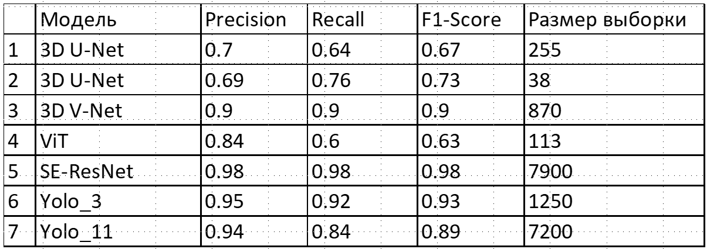

# AdrenalTumorDetectorClasifier
НИР "Диагностика заболеваний (образований) надпочечников с помощью ИИ"

## Актуальность
В настоящее время обнаружение поражений надпочечников основывается на ручном анализе, проводимом рентгенологами, что может отнимать много времени и быть субъективным. Существует потребность в более эффективных методах обнаружения этих поражений. 

## Новизна
Использование новых нейросетевых архитектур для сегментации и классификации КТ-изображений, адаптированных для мелких анатомических структур.

## Цели проекта
повышение эффективности диагностики (сокращение времени процедуры и повышение точности) заболеваний надпочечников по снимкам КТ путем разработки и создания интеллектуального программного модуля. 

## Задачи проекта
1) Исследование проблемной области и существующих решений.
2) Выбор архитектуры и проведение серий экспериментов по настройке моделей ИИ для задачи сегментации и классификации поражений надпочечников.
3) Реализация программного модуля, предназначенного для анализа КТ-снимков, встраиваемого в МИС и возвращающего информацию о найденных дефектах.

## Данные 
- 228 КТ-снимков, предоставленных Институтом Эндокринологии Минздрава России. Формат снимков - .mp4. Такой формат обуславливается 3D форматом съемки, то есть набор срезов КТ-съемки брюшной полости. Для удобства просмотра и работы с изображениями они были приведены в формат видео со съемкой (сверху-вниз)
(видео)

- Вся выборка была поделена на 3 класса:
1) Доброкачественный фенотип
2) Неопределенный фенотип
3) Злокачественный фенотип

## Пайплайн решения

## Сегментация 
- Подготовлен специальный датасет (7200 кадров).
- Использована модель yolo11s-seg, предобученная на датасете COCO

- результат работы последней версии обученной модели

- Таблица с метриками обученной модели:

## Классификация
Лучшие метрики продемонстрировала модель на базе ResNet50, матрица ошибок классификации представлена ниже

